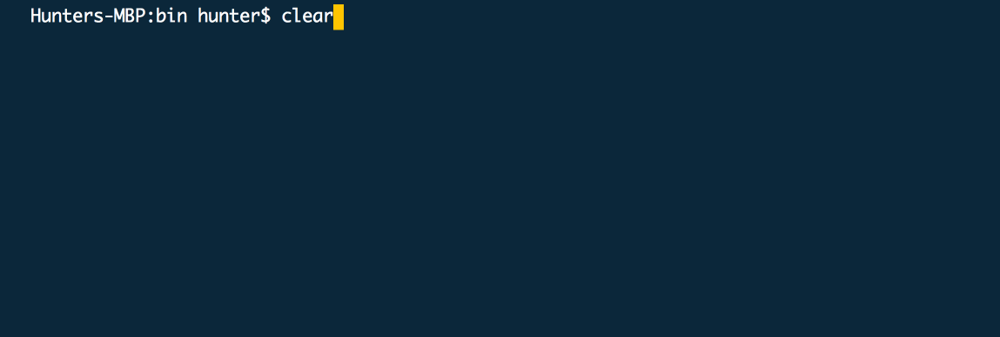
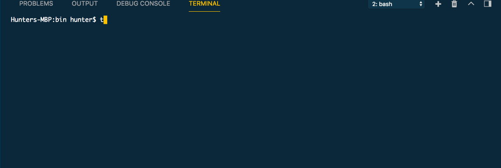

# TWG React Tools

This is a set of tools to help React Developers work more quickly by giving them access to TRT (TWG-React-Tools).

TRT helps you perform better, faster - by allowing you to quickly perform tasks that are common to most TWG reacters

The tools in this set adhere to [TWG's react guidelines](https://github.com/twg/react-guidelines)

This suite of tools is comprised of a library of components and commands - including, but not limited to:

* A visual [storybook](https://storybook.js.org/) of commonly used components at TWG
* A command line tool to copy these components into a project
* A command to generate all files associated with a new component in the style that TWG prefers

_*NEW!*_
* Generate a react app with the structure that TWG prefers!

# Installing && Updating
You can easily add TRT to your globals by adding

`yarn global add twg-react-tools`

or

`npm install -g twg-react-tools`


This will take a couple moments while it installs the dependencies for storybook

# Using - commands

## Storybook

Starting storybook to get a local view of storybook is easy thanks to trt!

`trt storybook` or `trt sb`

This starts Storybook on http://localhost:6006

## Generate

This command will generate a new react component using TWG's style guide - complete with a .js, .css, and testing file inside of a folder in the location that you run this command.

The root command for this is: `trt generate` (also available with `trt g`)

### Generate options

There are currently three different options for generating:
  * Class component
  * * Class component with Redux bootstrapped
  * Stateless component
  * Styled component

If you're unsure about the difference between stateless and class components, [here](https://jaketrent.com/post/smart-dumb-components-react/) is an excellent resource.

This process is a guided wizard scenario, this wizard will guide you through the process of generating your component in a multi-step process

* Step 1 asks you for your desired Component name
  * This field is required to be changed
* Step 2 asks you for the place where you'd like your component to be generated
  * This defaults to your current directory
* Step 3 will guide you through asking which type of component you'd like to generate



## Include

This command will include a component from the library (you can see the list of available components in the storybook)

The root command for this is: `trt include`

There are 2 arguments for this command:

* Argument 1 is *required* and is the name the component you want to include from TRT
* Argument 2 is optional - this is the target location for the included component - default is current directory

`trt include Tooltip` or `trt include Tooltip ./components`

### Autocomplete
Oh. So you like autocompletion? You don't want to have to memorize the millions of different components that the library has to offer? We've got you covered! Autocomplete is now part of the CLI (though, it's going to take a little work on your part, if you're willing. It'll make your life nice, I promise.)

Is it a little buggy? Yeah. I ain't know why, I'm sorry.

All these instructions assume you're on a Mac:

* Install bash completion with brew
* * brew install bash-completion
* Run the following command in your terminal
* * `trt completion `echo $SHELL | xargs basename` > $(brew --prefix)/etc/bash_completion.d/trt`
* Add the following to your .bashrc file
```
if [ -f $(brew --prefix)/etc/bash_completion ]; then
. $(brew --prefix)/etc/bash_completion
fi
```

## Create

This command will create a new react app using TWG's style guide. This is an app that's been initialized with create react app (so you still get to use all those great utility scripts and configs), and has been updated to include a better folder structure for building apps on top of.

This app will also include redux, as well as suggested ways to structure your stores

The root command for this is: `trt create` (also available with `trt c`)

### Create options

This process is a guided wizard scenario, this wizard will guide you through the process of generating your app in a multi-step process

* Step 1 asks you for your desired app name
  * This field is required to be changed
* Step 2 asks you for the place where you'd like your app to be created
  * This defaults to your current directory
* Step 3 asks if you'd like to include prettier in your app. If you select yes, this will include [prettier](https://prettier.io/) and add a pre-commit githook to auto execute prettier
* Step 4 asks if you'd like to include a travis.yml setup in your app. If you select yes, this will include a [travis](https://travis-ci.com/) config file which includes at typical react app deploy process that includes S3



# Development
## Get started

Install `yarn` (if necessary)

```bash
$ brew install yarn
```

Checkout the repo and install dependencies

```bash
$ git clone https://github.com/twg/react-component-library
$ cd react-component-library
$ yarn
```

## Run the styleguide server for development

```bash
$ yarn run storybook
```

Then visit [http://localhost:6006](http://localhost:6006) in your browser.

## Exporting static storybook

(this can take a moment...)

```bash
$ yarn build-storybook
```

## Contributing
If you have a component and some stories that you think should be included, there are a couple of ways to get it into TWG's storybook.

* Just let any of the maintainers know, we'll help out.
* Create a PR with your new component and some stories
  * Add the component's source into a new folder in src
    * Components should be as agnostic as possible to allow easy inclusion into all sorts of projects. Do not assume Redux/non-react state libraries
    * Components have to use css modules and do not support sass/less
    * Please include a README with some basic usage details for your component
    * Components that recieve props should have their PropTypes documented in /* */ style - this is the style supported by our storybook plugins
  * Add a file to the stories folder that exports a function that creates stories
    * At the very least, a component has to have a story that allows the user to alter params ([We Use Knobs](https://github.com/storybooks/storybook/tree/master/addons/knobs))
    * ( Check the existing stories for button, tooltip & grid for examples )
    * The documentation for storybook can be found [here](https://github.com/storybooks/storybook) - @hyperwidget would be glad to help too
  * Add your new story file to /stories/index.js
